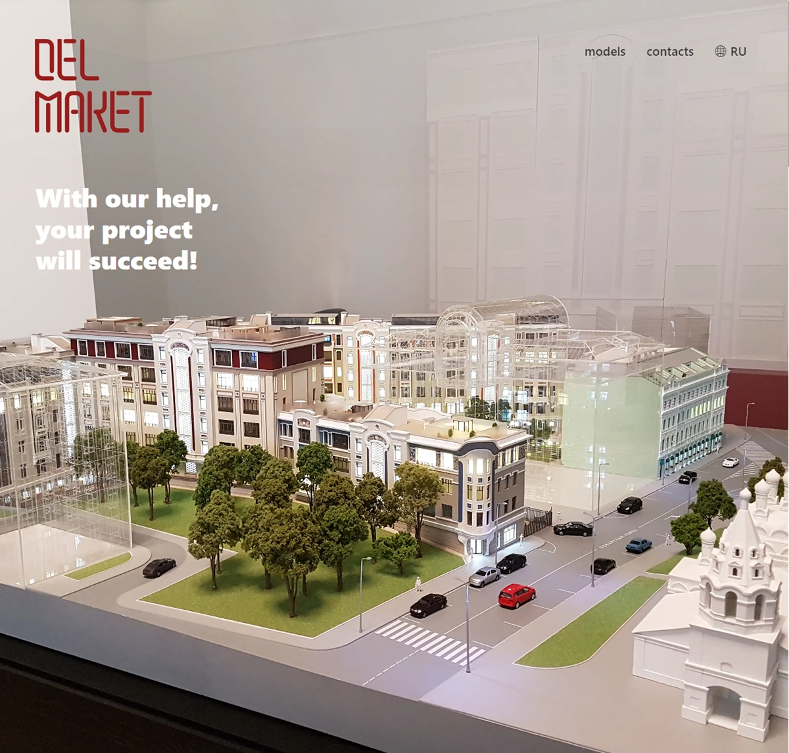
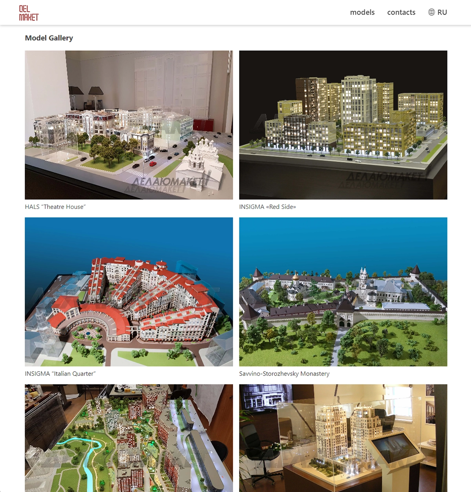
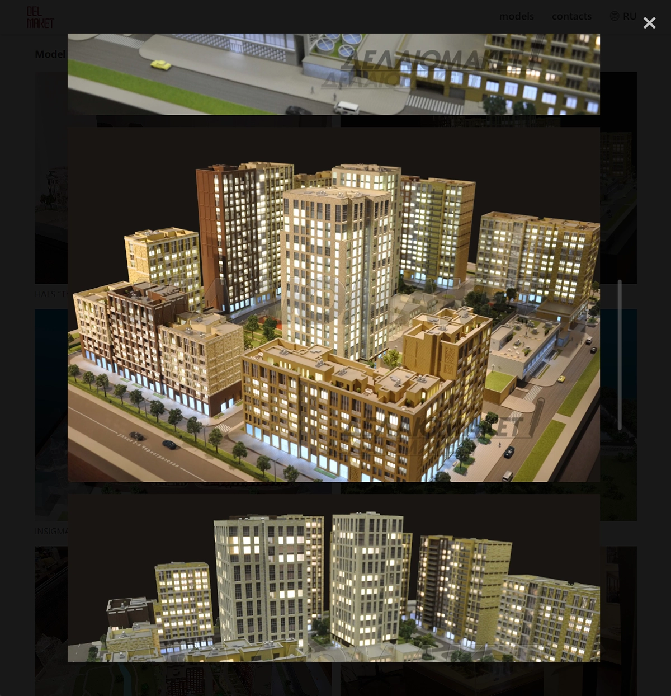
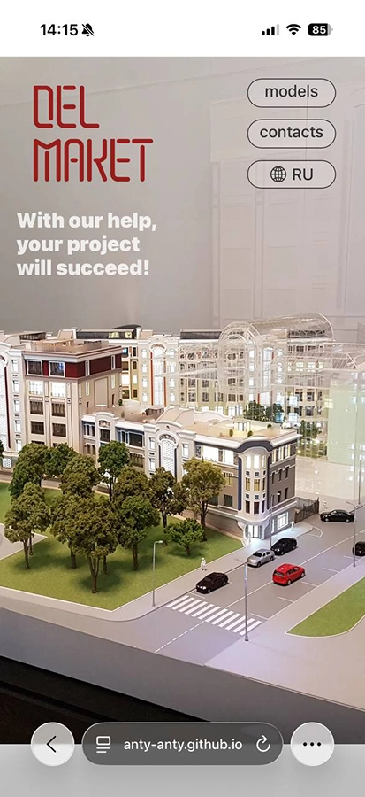

# Architectural Model Studio Website

A production website for an architectural model studio, built with React.
The site showcases the studio’s portfolio, services, and contact information, with a strong focus on performance, responsive design, and smooth user interaction.

## Live website: 
https://anty-anty.github.io/delmaket/#/en

## Overview

This project is a real-world marketing website created for an architectural model studio.
It presents a large visual gallery, company information, and contact details in a clean, scroll-based layout.

The application is fully frontend-driven and does not require a backend — all content is static and optimized for fast loading and reliability.

## Tech Stack
- React
- Vite
- React Router (HashRouter)
- Custom CSS
- Native browser APIs
- Lazy loading & responsive images

## Why I Built This

This project was built to deliver a production-ready frontend for a real client while practicing:
- Component-driven UI architecture
- Scroll-based navigation and layout behavior
- Image-heavy performance optimization
- Modal and gallery UX patterns
- Multilingual routing without a backend

## Key Technical Decisions
<details>

### 1. Hash-Based Routing for Static Hosting
The site uses HashRouter to support client-side routing on static hosting environments without server configuration.

```jsx
<HashRouter>
  <Routes>
    <Route path="/" element={<MainPage />} />
    <Route path="/en" element={<MainPageEN />} />
  </Routes>
</HashRouter>
```

This allows:
- Language switching (/ and /en)
- Reliable navigation on static hosting
- Zero backend dependency

### 2. Scroll-Based Navigation (Single-Page UX)
Navigation uses react-scroll to smoothly move between sections:
- Home
- Gallery
- Contacts

This creates a landing-page experience while keeping the code modular and readable.

### 3. Responsive Image Strategy
The site uses:
- <picture> for responsive assets
- Mobile-specific images under width breakpoints
- Lazy loading for gallery images

This significantly improves performance on image-heavy pages.

### 4. Dynamic Gallery Loading

Gallery modals dynamically load images by probing available files:
- Images are loaded sequentially
- Loading stops when the next file is missing
- A spinner is shown while loading

This avoids hardcoding gallery sizes and keeps content flexible.

### 5. Modal-Based Image Viewer
The gallery uses a custom modal component with:
- Loading state
- Scrollable content
- Clean exit behavior

This keeps user focus on the content while avoiding route changes.

### 6. UI State Derived from Browser Events

The header dynamically changes style based on scroll position using native scroll listeners.
This avoids unnecessary libraries and keeps behavior predictable.
</details>

## Features
### 🖼 Portfolio Gallery

- Image grid with preview thumbnails
- Modal-based full gallery view
- Lazy-loaded assets
- Responsive layout

### 🌍 Multilingual Support

- Separate routes for different languages
- No backend or i18n library required

### 📱 Responsive Design
- Optimized layouts for mobile and desktop
- Conditional image loading for smaller screens

### ⚡ Performance-Focused
- No backend latency
- Static assets
- Minimal dependencies

## Project Structure

- `pages/` – Main language-specific pages
- `components/` – Reusable UI components (Modal, Footer, Spinner)
- `images/` – Optimized static assets
- `App.jsx` – Routing and app entry point

## What This Project Demonstrates

- Real-world frontend delivery
- Clean React component architecture
- Performance-conscious UI decisions
- Ability to build production-ready static sites
- Experience working with visual-heavy content

## Screenshots

### Landing Page


### Portfolio Gallery


### Image Viewer Modal


### Mobile View


## Notes

This project intentionally does not include a backend:
- No authentication
- No CMS
- No database

This was a deliberate choice to keep the site fast, reliable, and easy to deploy.

## License

Private / Client project 
Code shown here is for portfolio demonstration purposes.